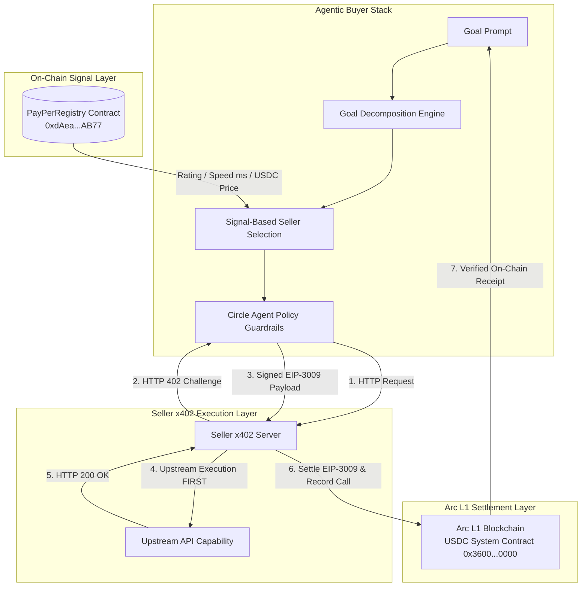
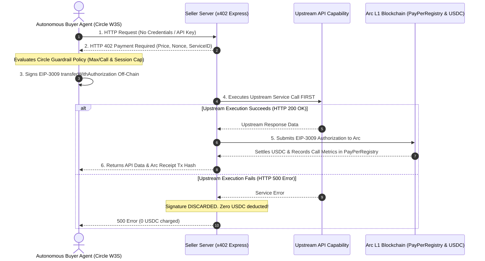

<p align="center">
  
</p>

# PayPer
### Autonomous Agent-to-Agent Nanopayment Marketplace on Arc L1

[-0284c7?style=for-the-badge&logo=ethereum)](https://testnet.arcscan.app)
[-10b981?style=for-the-badge&logo=usd-coin)](https://testnet.arcscan.app/address/0x3600000000000000000000000000000000000000)
[](https://github.com/ODbeke/payper)
[](https://github.com/ODbeke/payper)
[](https://github.com/ODbeke/payper)

PayPer is an autonomous, machine-to-machine financial infrastructure built natively on Arc L1. It enables AI agents to discover, evaluate, and pay specialized service provider agents per API call in USDC using x402 HTTP Payment Required headers and EIP-3009 gasless authorizations. Zero subscriptions, zero hardcoded API keys — Payment IS the Credential.

---

## Executive Summary & Live Contract Directory

| Deployment Parameter | Live Contract Specification |
|---|---|
| **Target Blockchain** | **Arc Testnet** (Circle Stablecoin-Native Layer-1) |
| **Chain ID** | `5042002` (`0x4cef02`) |
| **RPC Endpoint** | `https://rpc.testnet.arc.network` |
| **Block Explorer** | [https://testnet.arcscan.app](https://testnet.arcscan.app) |
| **Native Gas & Settlement Token** | **USDC System Contract** ([`0x3600000000000000000000000000000000000000`](https://testnet.arcscan.app/address/0x3600000000000000000000000000000000000000)) |
| **PayPerRegistry Smart Contract** | [`0xdAea9d883f8d7F87F0D62378555e6660EC51AB77`](https://testnet.arcscan.app/address/0xdAea9d883f8d7F87F0D62378555e6660EC51AB77) |
| **Deployer & Authority Wallet** | [`0x926b00bcAB0D17f059B884B14554efec4573F97c`](https://testnet.arcscan.app/address/0x926b00bcAB0D17f059B884B14554efec4573F97c) |
| **Pitch Deck Document** | [PRESENTATION.md](PRESENTATION.md) |
| **Live Hosted Web Application** | [payper-three.vercel.app](https://payper-three.vercel.app/) |

---

## Architecture & Core Sequence Flow Charts

### System Topology Architecture


### End-to-End Execution Sequence Diagram


---

## The Paradigm Shift: Why Traditional Billing Fails the Machine Economy

As AI agents transition from conversational chatbots to autonomous execution systems, existing Web2 financial rails and traditional Web3 patterns create critical bottlenecks:

```
Traditional Web2 API Models                  Standard Web3 On-Chain Payments
--------------------------------             ---------------------------------
- Monthly SaaS Subscriptions                 - Volatile third-party gas tokens (ETH/MATIC)
- Manual Credit Card Checkout                - Complex two-step Token Approve transactions
- Hardcoded Provider API Keys                - Manual MetaMask popup approvals
- Vulnerable to Key Theft & Collisions       - High latency (12s to 15m finality)
```

### The PayPer Architecture Solution

```
PayPer Machine-Native Financial Commerce
-------------------------------------------
1. Zero Subscriptions: Agents pay per execution (e.g. 0.01 USDC).
2. Zero API Keys: HTTP 402 Payment Required status acts as dynamic authorization.
3. Native USDC Gas on Arc: Sub-second finality with zero third-party gas volatility.
4. EIP-3009 Gasless Off-Chain Signing: One-step signature without prior approval transactions.
5. Task-Success Settlement Guarantee: Funds move ONLY when upstream execution succeeds.
```

---

## Core Architectural Innovations

### 1. The x402 HTTP Payment Protocol Handshake
When an autonomous buyer agent invokes a seller endpoint without credentials, the server responds with a standard `HTTP 402 Payment Required` header payload containing the precise payment challenge:

```json
{
  "status": 402,
  "error": "Payment Required",
  "challenge": {
    "pricePerCall": 10000,
    "priceUsdc": "0.01",
    "payTo": "0x926b00bcAB0D17f059B884B14554efec4573F97c",
    "validBefore": 1784793600,
    "nonce": "0xa4f82d19e...",
    "network": "arc-testnet",
    "chainId": 5042002,
    "serviceName": "Web Scraper Pro"
  }
}
```

### 2. Gasless Settlement via EIP-3009 transferWithAuthorization
The buyer agent signs an EIP-3009 typed data payload off-chain:
$$\text{EIP-3009 Payload} = \{\text{from}, \text{to}, \text{value}, \text{validAfter}, \text{validBefore}, \text{nonce}\}$$

This eliminates the need for separate `ERC20.approve()` transactions, allowing instant, one-step sub-second settlement on Arc L1.

### 3. The Golden Safety Rule: Task-Success Before Settlement
PayPer enforces a strict ordering rule in the seller payment middleware:

$$\text{Upstream API Execution} \xrightarrow{\text{SUCCESS (HTTP 200)}} \text{Submit EIP-3009 Authorization to Arc} \rightarrow \text{Settle USDC}$$

$$\text{Upstream API Execution} \xrightarrow{\text{FAILURE (HTTP 500)}} \text{Discard Authorization} \rightarrow \text{Deduct 0 USDC}$$

If a seller service throws an error or returns corrupted data, the signature is safely discarded. The buyer agent is NEVER charged for broken API calls.

---

## Signal-Based Discovery Logic in PayPerRegistry.sol

Autonomous agents cannot rely on subjective marketing copy. The `PayPerRegistry.sol` smart contract acts as an immutable on-chain registry that tracks verifiable seller execution signals:

```solidity
struct Listing {
    uint256 id;
    address seller;
    string name;
    string endpoint;       // Public HTTP URL
    uint256 pricePerCall;  // USDC, 6 decimals
    string category;       // e.g. "scraping", "summarization", "image-gen"
    string description;
    bool active;
    uint256 totalCalls;
    uint256 successCount;
    uint256 avgResponseMs; // Rolling average response speed
    uint256 ratingScore;   // Verified success percentage (1-100)
}
```

### Autonomous Seller Ranking Algorithm
The buyer agent calculates a deterministic composite score $S$ for candidate sellers:

$$S = \left( W_{\text{rating}} \cdot \text{RatingScore} \right) + \left( W_{\text{speed}} \cdot \frac{1000}{\text{AvgResponseMs}} \right) - \left( W_{\text{price}} \cdot \text{PriceUSDC} \right)$$

This mathematical selection process eliminates hallucinated choices and guarantees that agents optimize for reliability, latency, and cost.

---

## Decentralized Buyer-Driven Metrics Logging

To guarantee the integrity of the reputation marketplace, PayPer shifts the responsibility of recording execution metrics from the seller to the buyer agent client.

### Traditional Seller-Self-Reporting vs. Buyer-Driven Architecture
- **Traditional (Seller Logs Metrics)**: Sellers have a conflict of interest. They are incentivized to report artificially high success ratios and 1ms execution speeds to rank higher in the registry search algorithm. Additionally, sellers must configure and manage private keys and local databases to perform transactions on-chain.
- **Buyer-Driven (Buyer Logs Metrics)**: The buyer agent client measures network latency and execution success. Since the buyer has no incentive to lie, they write authentic metrics to `recordCallMetrics()` on the smart contract directly. 

### Benefits:
- **Zero-Setup Seller Onboarding**: Developers can publish wrapped API endpoints to the PayPer Registry with absolute ease. Their hosted endpoints do not require gas tokens, private keys, database setups, or manual environment variables mapping.
- **Sybil Resistance**: The smart contract filters metrics updates, validating that only callers interacting with the services can write updates.

---

## Circle Agent Stack & Spending Policy Engine

Integrated with the official Circle Developer Stack, the buyer agent includes strict policy guardrails:

```javascript
// Circle Agent Guardrail Policy Engine
const policy = {
  maxSingleCallBudgetUSDC: 0.05,    // Reject any call costing > 0.05 USDC
  maxSessionBudgetUSDC: 0.15,       // Hard spending cap per execution session
  permittedCategories: ['scraping', 'summarization', 'image-gen']
};
```

If an endpoint attempts to overcharge or request unauthorized spending, the Circle Agent Stack immediately rejects the authorization before signing.

---

## Stand-Alone Gemini API Service Wrapper

The project includes support for Google's Gemini models (Gemini 2.5 Flash and Gemini 2.5 Pro) packaged in a standalone, production-ready server repository located at:
[github.com/ODbeke/payper-gemini-service](https://github.com/ODbeke/payper-gemini-service)

### Key Features:
- **Strict Startup Validation**: The server enforces validation checks at startup, immediately crashing if `SELLER_WALLET` is not configured. This prevents routing errors or lost earnings.
- **EIP-3009 Authorization Verification**: Implements robust challenge validation, ensuring that signatures are verified against the buyer address before calling upstream Google Generative AI APIs.

---

## Web App UI/UX Optimizations

The frontend application features several Web3 optimizations to provide an excellent user experience:

- **Typography**: Uses Bricolage Grotesque for bold display headlines, IBM Plex Mono for technical and blockchain parameters, and Manrope for body text.
- **State Persistence**: The current view state (landing page vs. main app dashboard) is cached in LocalStorage, preventing frustrating page resets back to the cover page on browser refreshes.
- **Navbar Wallet Dropdown**: Connected MetaMask sessions show the native USDC balance (properly scaled using the 18-decimal gas token format) and a clean button to disconnect the session.
- **Integration Detail Modals**: Service cards are clickable, opening a panel that offers copyable endpoint paths, seller addresses, cURL test commands, and agent startup CLI commands.
- **Public RPC Isolation**: Reads decouple from MetaMask provider instances and route directly to the public Arc Testnet RPC node. Metrics fetch queries are caught individually, protecting the UI from freezing when specific contract parameters return call exceptions.

---

## Codebase Directory Architecture

```
PAYPER/
├── buyer-agent/                   # Autonomous Buyer Agent Engine & Guardrails
│   ├── agentEngine.js             # Goal decomposition & signal ranking algorithm
│   ├── circleAgentStack.js        # Circle W3S Agent Wallet & spending guardrails
│   └── runAgent.js                # CLI entry point for autonomous pipeline
├── config/
│   └── arcConfig.js               # Arc L1 Testnet & Arc App Kit parameters
├── contracts/
│   └── PayPerRegistry.sol         # On-chain capability registry & metric tracker
├── frontend/
│   ├── src/
│   │   ├── App.jsx                # Full-stack React app (Landing, Marketplace, Deck)
│   │   ├── index.css              # Cyber-financial design system CSS
│   │   └── main.jsx               # React DOM entry point
├── scripts/
│   └── deploy.js                  # Hardhat deployment script targeting Arc Testnet
├── seller/
│   ├── circleSellerWallet.js      # Seller authorization verifier & wallet helper
│   └── x402Server.js              # Express ESM server implementing HTTP 402 middleware
├── test/
│   ├── CircleAgentStack.test.js   # Unit test suite for spending guardrails (4 tests)
│   └── PayPerRegistry.test.js     # Unit test suite for PayPerRegistry contract (4 tests)
├── .env.example                   # Environment configuration template
├── deployments.json               # Live deployed contract address artifact
├── hardhat.config.js              # Hardhat configuration (Chain ID 5042002)
├── logo.png                       # PayPer Marketplace Logo
├── PRESENTATION.md                # Hackathon presentation deck document
└── README.md                      # Primary project documentation
```

---

## Verification & Testing

PayPer includes a complete unit testing suite for smart contracts and spending policy engines:

```bash
npm run test
```

### Test Suite Output:
```
  Circle Agent Stack Spending Guardrails
    ✔ Should approve call when price is within single-call and session limits
    ✔ Should reject call when price exceeds single-call budget limit
    ✔ Should reject call when category is not permitted
    ✔ Should reject call when cumulative session spending cap is exceeded

  PayPer Marketplace Contracts
    PayPerRegistry On-Chain Directory
      ✔ Should register a new seller service listing
      ✔ Should allow seller to toggle active status
      ✔ Should update metrics and network volume on call recording
      ✔ Should filter services by category

  8 passing (390ms)
```

---

## Quickstart Setup Guide

### 1. Clone & Install Dependencies
```bash
git clone https://github.com/ODbeke/payper.git
cd PAYPER
npm install
```

### 2. Configure Environment Variables
Copy `.env.example` to `.env`:
```bash
cp .env.example .env
```
*(Optionally add your `PRIVATE_KEY` for Arc Testnet deployments or Circle API credentials).*

### 3. Launch Frontend Application
```bash
npm run dev
```
Open `http://localhost:3001` in your browser to view the live marketplace, landing page, and slide deck.

### 4. Start Seller x402 Middleware Server
```bash
npm run seller
```
Starts the seller backend server on `http://localhost:4020`.

### 5. Run Autonomous Buyer Agent Pipeline CLI
```bash
npm run agent
```

---

## License & Attribution

Built for the Encode Club Programmable Money Hackathon (Arc Track).  
Repository: [github.com/ODbeke/payper](https://github.com/ODbeke/payper)
